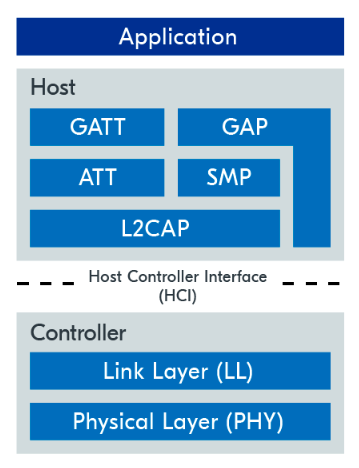

# nRFConnectSDK BLE Fundamentals
Nordic Semiconductor has deprecated the old nRF5 SDK and now all the new features are developed for their new SDK called nRF Connect which is based on [Zephyr RTOS](https://github.com/zephyrproject-rtos/zephyr): an open-source real-time operating system for connected and resource-constrained embedded devices. This repository is for my hands-on during the Bluetooth LE Fundamentals course, which can be found [here](https://academy.nordicsemi.com/courses/bluetooth-low-energy-fundamentals).

## SDK version and hardware used during the course 
- [nRF Connect SDK v2.5.0](https://developer.nordicsemi.com/nRF_Connect_SDK/doc/2.5.0/nrf/index.html)
- [nRF52840 DK](https://www.nordicsemi.com/Products/Development-hardware/nrf52840-dk) (64MHz ARM Cortex-M4F based SoC)

During lesson 6, I used extra hardware to run the nRF Sniffer application to detect and analyze Bluetooth LE packets:
- [nRF52840 Dongle](https://www.nordicsemi.com/Products/Development-hardware/nrf52840-dongle) (64MHz ARM Cortex-M4F based SoC)

NOTE: [Wireshark](https://www.wireshark.org/) desktop application was also used during lesson 6 to detect and explore BLE packets.

## Bluetooth LE Controller used during the course

As the image below illustrates, the Bluetooth LE (BLE) stack can be divided into two main components: the BLE Host and the BLE Controller. Regarding the BLE controller, the nRF Connect SDK contains [two implementations](https://developer.nordicsemi.com/nRF_Connect_SDK/doc/latest/nrf/protocols/bt/ble/index.html#zephyr-bluetooth-le-controller) of BLE controller:
-  SoftDevice Controller
-  Zephyr BLE Controller

This means users can use the open-source [Zephyr BLE controller](https://developer.nordicsemi.com/nRF_Connect_SDK/doc/latest/zephyr/connectivity/bluetooth/overview.html#bluetooth-overview) implementation, which is vendor independent. This course use the [SoftDevice Controller](https://developer.nordicsemi.com/nRF_Connect_SDK/doc/latest/nrfxlib/softdevice_controller/README.html#softdevice-controller) developed by Nordic itself, as it was designed specifically for the nRF52, nRF53 and nRF54 SoCs.

## Build and flash Instructions
You must use the nRF Connect for VS Code extension or use the west tool, which is part of the Zephyr RTOS build system:

### Using nRF Connect for VS Code extension ###
1. Add or open an existing application in the nRF Connect for VS Code extension.

2. Add a build configuration and choose the correct board to ensure the correct device-tree files are used. Then click the build option. 

3. Connect your board and flash the application by clicking the flash button if you are using the nRF Connect for VS Code extension.

### Using west tool ###
1. Locate your application path.
2. Build your application using the following command:

        west build --build-dir <custom_build_directory> -b <board_name> <path_to_your_project> --pristine

   - **build-dir** flag: to specify a custom build directory. If you don't which to specify a custom build directory for the build output you can ommit this flag.
   - **b** flag: to specify board you are using. In this course I used nRF52840DK so replace <board_name> with nrf52840dk_nrf52840. Your can find more details about board names [here](https://developer.nordicsemi.com/nRF_Connect_SDK/doc/2.4.0/nrf/app_dev/board_support/index.html#gs-programming-board-names).
   - **pristine** flag: use the pristine build option whenever you have made changes to your input files (as opposed to application/source code files), such as the prj.conf, to make sure that these changes are included in the new build. If you are only making changes to your source code then you can just use the regular non-pristine build option and ommit this flag.

3. Flash your application using the following command:
        
        west flash -d <build-path> --erase

    - **erase** flag: this command clears the full flash memory before programming. To erase only the areas of flash memory that are required for programming the new application you have to ommit this flag. With such approach, the old data in other areas will be retained.

## More info:
- [nRF Connect SDK Documentation](https://developer.nordicsemi.com/nRF_Connect_SDK/doc/latest/nrf/index.html)
- [Zephyr RTOS Documentation](https://docs.zephyrproject.org/latest/)
- [Build and Flash an application on the command line](https://developer.nordicsemi.com/nRF_Connect_SDK/doc/2.5.0/nrf/getting_started/programming.html)
- Soft
